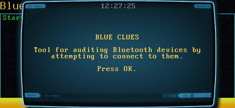
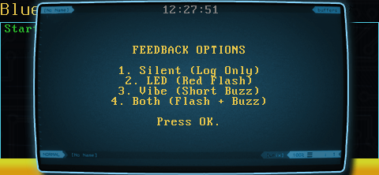
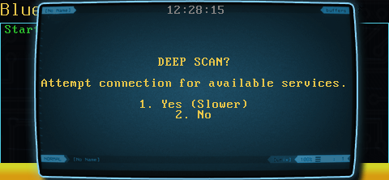
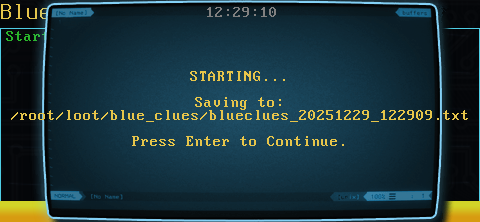
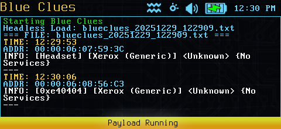

# Blue Clues

**Blue Clues** is an active Bluetooth auditing tool for the WiFi Pineapple Pager. Unlike passive scanners that simply listen, Blue Clues actively interrogates devices to uncover their **Vendor**, **Device Type**, and **Services**.

**Update: Active Audit & Deep Scan**
This tool has been upgraded from a simple scanner to an **Active Auditor**. It now performs OUI Lookups, Class-of-Device translation (e.g., identifying "Headsets" vs "Phones"), and Service Discovery (SDP) to reveal what a device is actually capable of.

---

### Features
* **Active Interrogation:** Connects to devices to request their "Real Name" if they are hiding it.
* **Deep Scan (SDP):** Optional mode to enumerate all services (Audio, File Transfer, etc.) offered by a device.
* **Vendor & Type Lookup:** Automatically translates MAC addresses into Manufacturers (OUI) and Hex Codes into Device Types (e.g., `[Headset]`, `[Smart Phone]`).
* **Smart Deduplication:** Tracks devices in memory to prevent duplicate alerts for the same target.
* **Ignore List:** Define a blacklist of MAC addresses (like your own phone) to remain invisible during scans.

---

### Workflow Tutorial

**1. Mission Briefing**
The payload begins by confirming the "Audit" workflow, which involves active connection attempts.


**2. Feedback Configuration**
Decide how the device should alert you when a *new* unique target is identified.
* **Silent:** Logs data invisibly.
* **LED/Vibe:** Visual (Red Flash) or Haptic buzz upon finding a new device.


**3. Deep Scan Selection**
Choose your depth of analysis:
* **No (Standard):** Fast. Grabs MAC, Vendor, Class, and Name. Skips Service Discovery if the device name is known.
* **Yes (Slower):** Thorough. Connects to *every* device to list all available services.


**4. Set Duration**
Enter the runtime for the audit (in minutes).


**5. Execution**
The device confirms the save location and begins the audit loop.


---

### 📊 Log Viewer Integration

Blue Clues is designed to work seamlessly with the **Log Viewer** payload. Upon completion, it automatically passes the captured data to the viewer for immediate analysis.

**Sample Output:**


---

### ⚙️ Configuration & Integration

#### Ignore List
To hide specific devices (like your own phone) from the scan, create a file named `ignore_list.txt` in the same directory as the payload. Add one MAC address per line.

#### Headless Integration
You can call the Log Viewer from this payload (or others) using the following arguments:

| Argument | Description | Example |
| :--- | :--- | :--- |
| **$1** | `File Path` | Absolute path to the log file. |
| **$2** | `Mode` | `1` = Color (Parsed), `2` = Raw Text. |

**Example Call:**
```bash
/root/payloads/user/general/log_viewer/payload.sh "/root/loot/blue_clues/scan.txt" 1
```